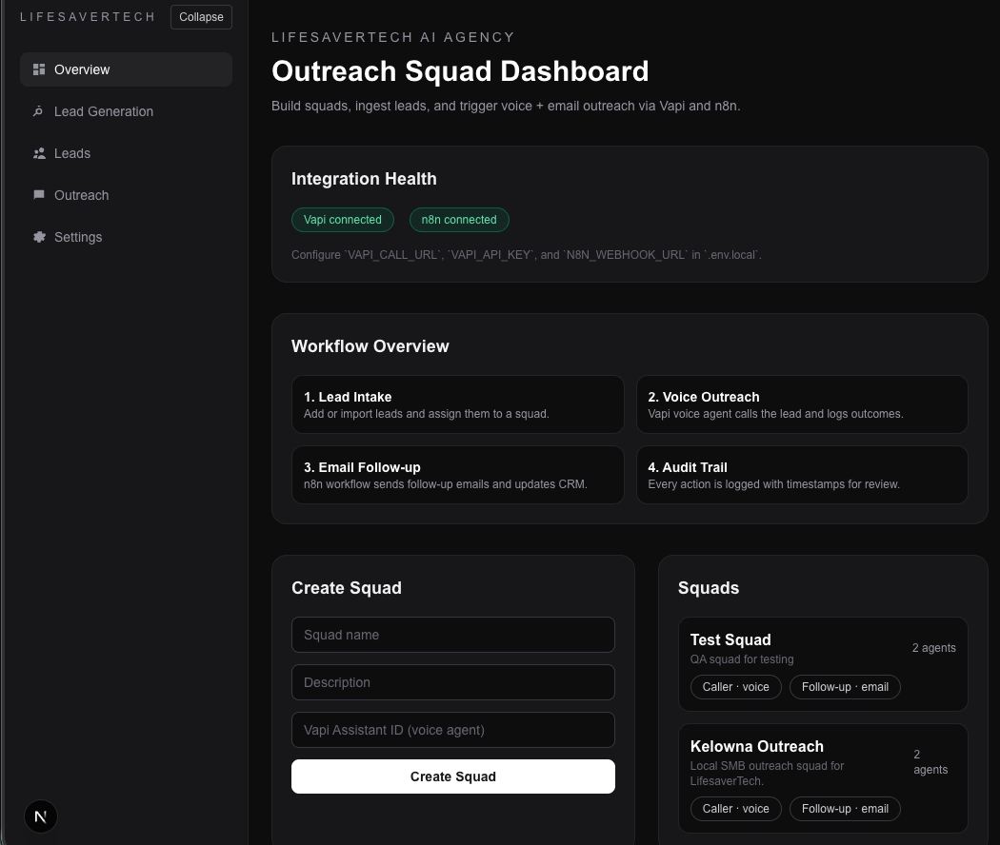

# AI Orchestration Platform — Portfolio

This directory is a public-facing, senior-level technical portfolio that
documents the full scope, architecture, and engineering decisions behind
LifesaverTech AI Agency. The platform was built to operate a local AI
automation consulting firm, Lifesaver Technology Services, using modern
AI engineering practices with explicit governance. The end goal is a
software-operated agency where lead qualification, outreach, onboarding, and
operations are progressively automated under deterministic control. Squads are
the primary execution unit, enabling multiple independent AI-operated teams to
run in parallel. It
reflects the actual system as implemented today and separates current
capabilities from planned expansions.

## For Recruiters and Founders
Short version: see `hiring-manager-summary.md` for a one-page overview focused
on outcomes, scope, and engineering depth. I’m open to both founding and
engineering roles; this portfolio highlights the systems I build, regardless of
path.

## What This Covers
- System intent, real-world value, and problem framing.
- Architecture, module boundaries, and orchestrator design.
- End-to-end workflow from lead discovery to outreach.
- Policy gating, auditability, safety, and compliance posture.
- Scalability, reliability, and future-proofing choices.
- Squad model and multi-team execution boundaries.
- Feature inventory with clear "current" vs "planned" tags.
- Engineering practices grounded in the actual codebase.

## Technology Stack
- **Frontend:** Next.js 16 (App Router), React 19, Tailwind CSS.
- **Backend:** Next.js route handlers with TypeScript.
- **Database:** SQLite via `better-sqlite3`.
- **Orchestration:** TypeScript control plane in `src/lib/orchestration/`.
- **LLM layer:** schema-constrained reasoning in `src/lib/llm/`.
- **Integrations:** Google Places API, Google Custom Search, Google Sheets,
  Vapi (voice), n8n (follow-up workflows).
- **Queueing:** in-process job queue for async dispatch.

## Contents
- `system-overview.md` - intent, real-world context, and product narrative.
- `architecture.md` - orchestrator-first architecture and module boundaries.
- `features.md` - complete feature inventory with status markers.
- `workflows.md` - end-to-end workflow and state machine overview.
- `auditability.md` - audit trail, observability, and replayability.
- `scalability.md` - scale strategy, reliability, and future-proofing.
- `roadmap.md` - planned capabilities and expansion scope.
- `engineering-practices.md` - architecture guardrails and engineering rigor.
- `hiring-manager-summary.md` - one-page summary for hiring teams.
- `demo.md` - sanitized end-to-end walkthrough.
- `diagrams.md` - architecture and lifecycle diagrams.
- `screenshots/` - curated product screenshots for hiring review.

## Screenshots (With Context)
Each image highlights a real, implemented capability in the product.

**Overview dashboard**
Shows system integration health and the end-to-end workflow summary, providing
an operator view into squad creation, integrations, and audit coverage.

More screenshots can be added as additional UI flows are captured.

## License
This dossier and the underlying codebase are proprietary.
See `LICENSE` in the repository root for terms. Portfolio materials only; no
source code is included. Public viewing permitted; no reuse rights are granted.
