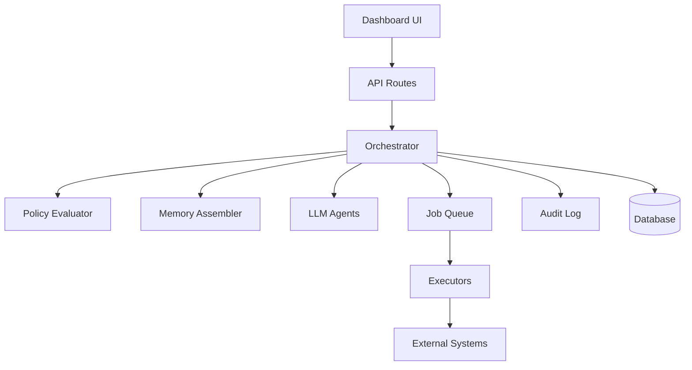
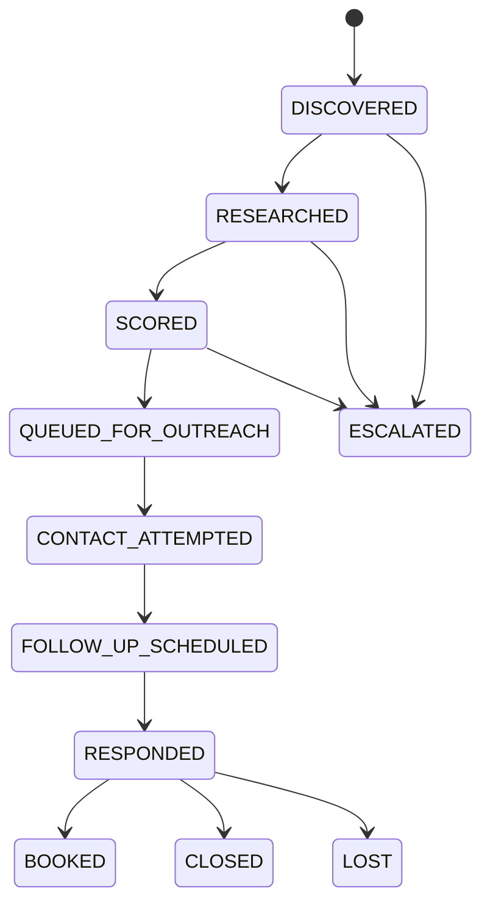

# Architecture Diagrams

## Orchestrator Control Plane

```mermaid
flowchart TD
  UI[Dashboard UI] --> API[API Routes]
  API --> ORCH[Orchestrator]
  ORCH --> POL[Policy Evaluator]
  ORCH --> MEM[Memory Assembler]
  ORCH --> AGENT[LLM Agents]
  ORCH --> QUEUE[Job Queue]
  QUEUE --> EXEC[Executors]
  EXEC --> EXT[External Systems]
  ORCH --> AUDIT[Audit Log]
  ORCH --> DB[(Database)]
```

## Lead Lifecycle (Simplified)

```mermaid
stateDiagram-v2
  [*] --> DISCOVERED
  DISCOVERED --> RESEARCHED
  RESEARCHED --> SCORED
  SCORED --> QUEUED_FOR_OUTREACH
  QUEUED_FOR_OUTREACH --> CONTACT_ATTEMPTED
  CONTACT_ATTEMPTED --> FOLLOW_UP_SCHEDULED
  FOLLOW_UP_SCHEDULED --> RESPONDED
  RESPONDED --> BOOKED
  RESPONDED --> CLOSED
  RESPONDED --> LOST
  DISCOVERED --> ESCALATED
  RESEARCHED --> ESCALATED
  SCORED --> ESCALATED
```
